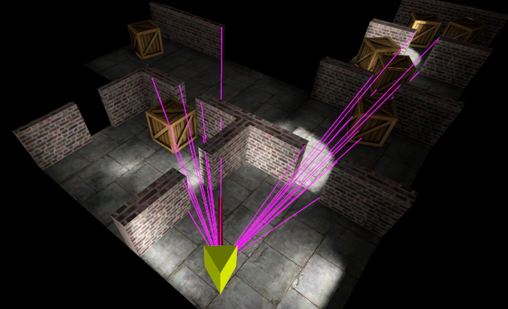
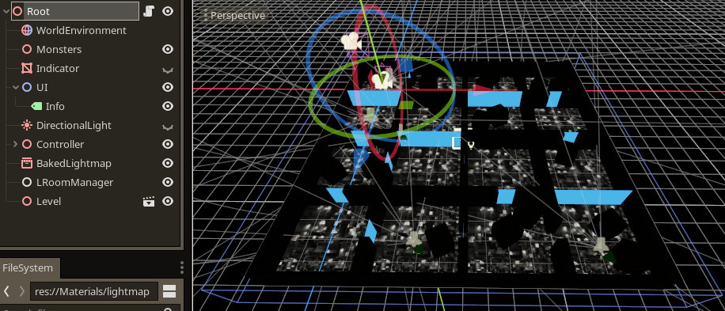
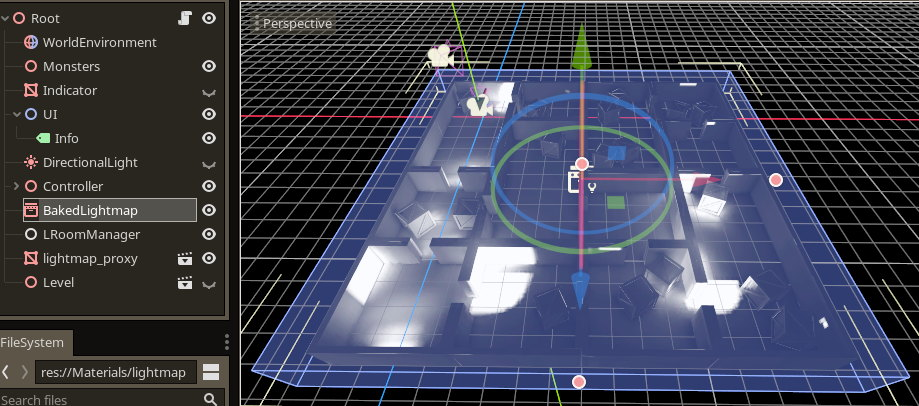

# Box Rooms
This demo is to show the internal baked lightmap workflow.

## Prerequisites
Before going through this tutorial, make sure you have been through the Tutorial-Simple tutorial. Also make sure you are familiar with the Godot BakedLightmap node, work through some official Godot tutorials:

https://docs.godotengine.org/en/3.1/tutorials/3d/baked_lightmaps.html

# Instructions

Before you start, try running the project as is. It should show the end product, the lightmapped level.

#### Keys:
* Space - Toggle 1st / 3rd person view
* Tab - Turn LPortal on and off
* Cursors - Move
* Home - Mouse look mode on / off
* End - Show debug culling planes
* Return - Reload level

We will now go about creating the lightmapped version of the map from the original, which does not contain a 2nd set of UV coordinates.

1) Open the root.gd script and at the top change the m_bPrepare variable from false to true.
2) With the 'Root' node selected, click the chain link icon 'Instance a scene file as a node'
3) Select `Levels/Map_NoUVs.tscn`. This is the game level prior to adding the second set of UVs.

4) Run the project. Once it has loaded fully, you can close it again, as it will have saved the necessary files.
5) Change the m_bPrepare variable back to false, ready for running the final level.

We must now bake the lightmaps:

6) Hide the 'Level' node.
7) With the 'Root' node selected, click the chain link again and select `Lightmaps/Lightmap_Proxy.tscn`. This is a merged mesh of the entire level that was created in the previous step.
8) At this point the level should be hidden, and the proxy only is showing in the viewport. Select the BakedLightmap node, and click 'Bake Lightmaps' (button above the viewport).

If all goes well you should now see the proxy mesh with a lightmap applied. We now having everything prepared to run the game.
9) Delete the level node, and the proxy node, then run the game. The script will automatically load the final level if m_bPrepare is set to false.

## Notes

### Preparation phase
In the preparation run (step 4) the script creates 2 files:
1) `Lightmaps/Lightmap_Proxy.tscn` - This is the merged mesh containing the whole level, with secondary UV coordinates automatically created by godot
2) `Levels/Map_Final.tscn` - This is the entire level as loaded before, except also containing secondary UV coordinates that match the proxy mesh.

By lightmapping the proxy we are also creating a single lightmap that will match the original level made up of separate objects. This gets around the Godot limitation that it can only create one lightmap per object (which will end up creating large numbers of lightmaps for a large level).

### Why is the lightmap not baked automatically as part of the preparation phase?
Why do I have to bake the lightmap manually? This is simply because of a bug in the godot lightmapping code where it currently only works from the editor. Annoying to have an extra step and I will try and encourage the lightmapper to be fixed in core.

#### Graphical anomalies
You may notice certain bugs when using the internal workflow, that result in incorrect lighting in places. I believe there are bugs in the Godot auto UV mapping (using xatlas), as well as the voxel nature of the Godot lightmap baker which can lead to light leaks. Gradually we hope to fix UV mapping bugs in core, and JFons has been working on an updated ray tracing baker.

Until then if these problems are too much for your game, consider using the external lightmap workflow, where UV mapping and lightmapping is performed in an external modelling program such as Blender.

### Sharks
If you look carefully you may see sharks swimming around the level. They are just intended as a very rough example of registering and updating DOBs (dynamic objects). Note that they are in the scene graph separately from the levels (room list) itself.

The sharks will not cull completely correctly because they are moving at random and should really be constrained to moving only through portals. If they pass through a wall for example, LPortal may lose track of which room they should be inside. In a real game you would use something like physics to prevent them moving between rooms except through portals.

Although the sharks don't cast shadows, if the BakedLightmap node is showing, the sharks will change their lighting according to where they are in the level. This is because the BakedLightmap as well as creating a lightmap, also creates a 3d voxel structure which approximately stores the lighting in each cell. This looks nice but of course is expensive at runtime, if you switch off the BakedLightmap you may get an approximate doubling of frame rate.

### Measuring performance
You can get a very rough idea of overall performance by choosing ProjectSettings->Debug->Settings->PrintFPS ON, then turning off vsync by going to ProjectSettings->Display->Window->Use VSync OFF.
* Press TAB to turn LPortal on and off and notice differences in fps
* Try resize the window to postage stamp sized. This in general is a great way to see whether you are limited by fill rate, or by other tasks (primarily geometry processing in this case). If the frame rate increases when in a small window, you are fill rate limited. In this demo on most machines the frame rate should increase in a small window.
